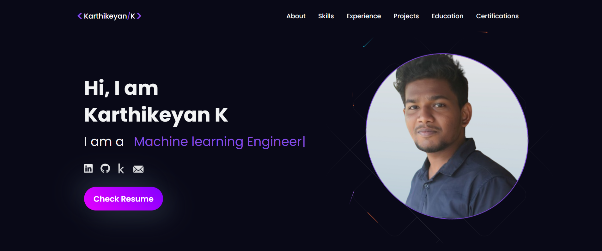
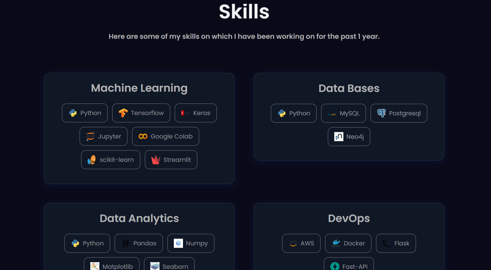
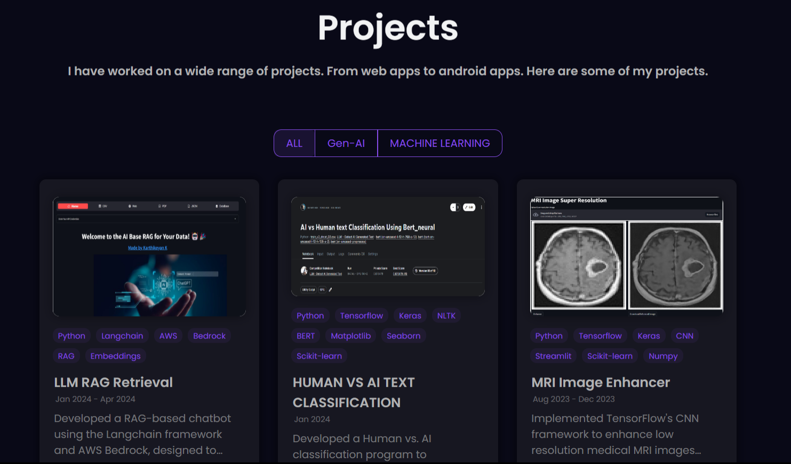
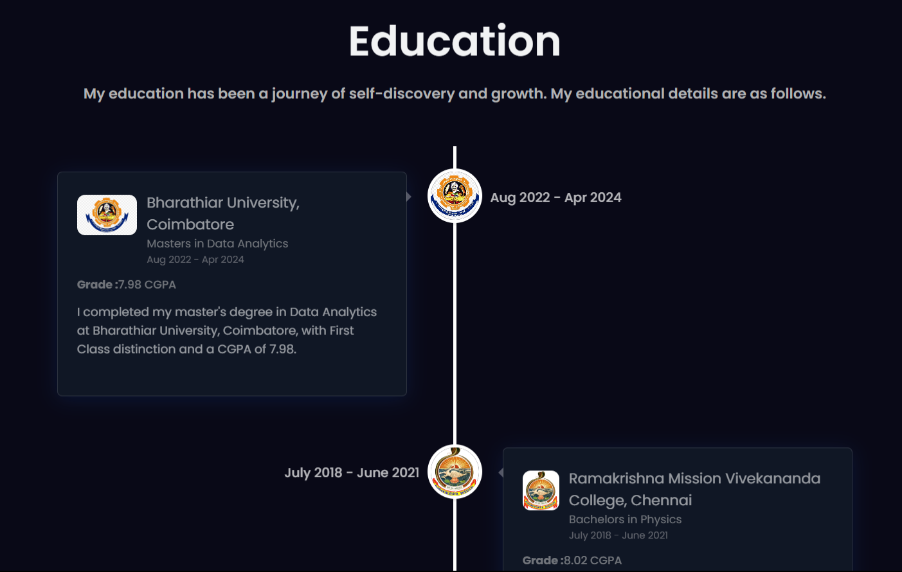
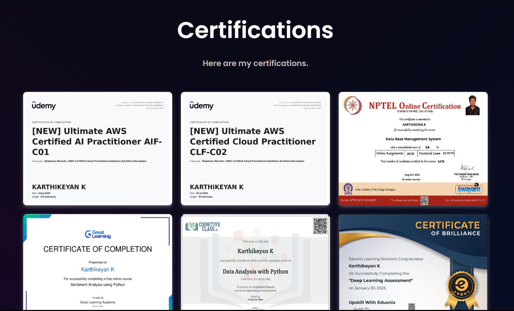

# 🌐 My Portfolio

Welcome to my portfolio! This project highlights my journey, skills, and projects as a **Machine Learning Engineer** and **Data Scientist**.

🔗 **Weblink:** [Live Website](https://kkarthik3.github.io)

## 📸 Project Screenshots
| Section      | Image |
|--------------|-------|
| Hero         |  |
| Skills       |  |
| Experience   |  |
| Projects     |  |
| Education    |  |
| Certifications |  |

---

## 📚 Table of Contents
- [Introduction](#introduction)
- [Features](#features)
- [Technologies Used](#technologies-used)
- [Installation](#installation)
- [Usage](#usage)
- [License](#license)

---

## 🚀 Introduction

This portfolio is a **React.js application** designed to serve as my online portfolio, showcasing my background, work, and achievements. Here, you’ll find a collection of my projects, my skillset, and a way to reach out to me.

---

## ✨ Features
- **About Me**: Insight into my background, skills, and experience.
- **Projects**: Detailed view of my notable projects with descriptions, images, and links.
- **Skills**: Display of my technical expertise.
- **Resume**: Downloadable version of my resume.
- **Contact Form**: Easy way to send me messages or inquiries.

---

## 🛠 Technologies Used
- **React.js**: For building user interfaces.
- **HTML5 & CSS3**: Structure and styling for the web.
- **JavaScript**: Adds interactivity to the application.
- **Styled-Components**: CSS-in-JS for component styling.
- **Git**: Version control for tracking changes.
- **GitHub Pages**: Hosting and deployment platform.

---

## 🛠 Installation

To run this portfolio locally, follow these steps:

1. **Clone the repository**:
   ```bash
   git clone --branch master https://github.com/kkarthik3/kkarthik3.github.io.git
2. **Navigate to the project directory**:
   ```bash
   cd kkarthik3.github.io
3. **Install dependencies**:
   ```bash
   npm install
4. **Start the development server**:
   ```bash
   npm start
5. **Open your browser and go to**
   ```bash
   http://localhost:3000
   ```

## 📖 Usage

Once the project is running locally, you can explore each section of the portfolio through the navigation menu:

- **About Me**: Overview of my background and technical skills.
- **Projects**: Detailed project descriptions with links and screenshots.
- **Contact**: Use this form to connect with me directly.

---

## 📝 License

This project is licensed under the [MIT License](LICENSE).
